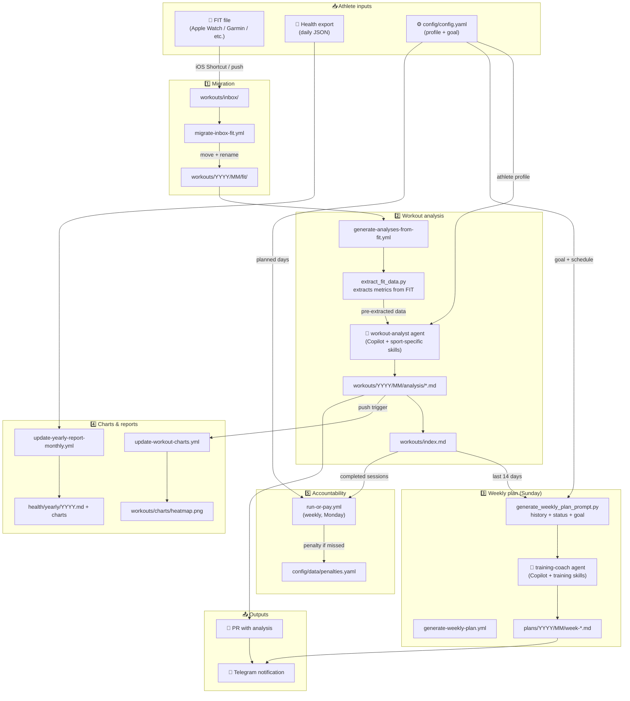

# 🏋️ Trainer Template

A GitHub-based **personal AI training coach** that works with any sport. Upload a FIT file from your watch or device and get automatic AI-powered workout analysis, personalized weekly training plans, progress charts, and optional accountability through a "train or pay" penalty system.

> Works with running, cycling, swimming, cross-training, and any activity your FIT-compatible device records.

## How it works



## Features

- 📊 **Automatic workout analysis** — upload a FIT file, get an AI-generated analysis adapted to the sport (running, cycling, swimming, cross-training...)
- 📅 **Weekly training plans** — AI generates personalized plans based on your goal, history, and current fitness
- 🔥 **Workout heatmap** — visual overview of training consistency over the last 52 weeks
- 📈 **Yearly health report** — charts for HRV, sleep, resting HR, and workout volume
- 💸 **Train or Pay** — optional penalty system to keep you accountable
- 🌍 **Multi-sport** — adapts analysis and planning to any FIT-compatible activity

## Quick Start

### 1. Use this template

Click **"Use this template"** → **"Create a new repository"**

### 2. Configure your profile

Edit `config/config.yaml` with your personal data:
- Date of birth, weight, height (used for heart rate zone estimates)
- Your preferred training days
- Your goal (create a file in `config/goals/` using `templates/goal-template.md`)

### 3. Set up GitHub secrets

Go to **Settings → Secrets and variables → Actions** and add:

| Secret | Description |
|--------|-------------|
| `COPILOT_TOKEN` | GitHub personal access token with Copilot access |
| `TELEGRAM_CHAT_ID` | Your Telegram chat ID (for notifications) |
| `TELEGRAM_BOT_TOKEN` | Your Telegram bot token (for notifications) |

> Telegram notifications are optional — workflows will still run without them.

### 4. Upload your first workout

Use the provided iOS Shortcut (see `docs/SETUP.md`) or manually upload a FIT file to `workouts/inbox/`.

The workflow will automatically:
1. Move the FIT file to the correct `workouts/YYYY/MM/fit/` folder
2. Generate an AI workout analysis (adapted to the sport type)
3. Update charts and indexes
4. Create a PR with the analysis + Telegram notification

## Repository Structure

```
├── config/
│   ├── config.yaml          ← your personal profile (edit this)
│   ├── config.schema.json   ← validation schema
│   ├── goals/               ← your training goals
│   └── data/
│       └── penalties.yaml   ← train-or-pay tracking
├── workouts/
│   ├── inbox/               ← drop FIT files here
│   ├── YYYY/MM/
│   │   ├── fit/             ← migrated FIT files
│   │   └── analysis/        ← AI-generated analysis (.md)
│   ├── charts/              ← heatmap and charts
│   └── index.md             ← workout index
├── health/
│   └── daily/               ← daily health JSON exports
├── plans/
│   └── YYYY/MM/             ← weekly training plans
├── scripts/                 ← Python scripts
├── templates/               ← markdown templates
├── tests/                   ← test suite
└── docs/                    ← documentation
```

## Documentation

- [Setup Guide](docs/SETUP.md) — detailed setup instructions including iOS Shortcut
- [Usage Guide](docs/USAGE.md) — how to use all features
- [Architecture](docs/ARCHITECTURE.md) — technical overview

## Requirements

- GitHub account with **GitHub Copilot** access
- Python 3.x (for local development/testing)
- Optional: iOS device with Shortcuts app (for easy FIT uploads)
- Optional: Telegram bot (for notifications)

## Workflows

| Workflow | Trigger | Description |
|----------|---------|-------------|
| `migrate-inbox-fit` | Push FIT to `workouts/inbox/` | Moves FIT to `YYYY/MM/fit/` and triggers analysis |
| `generate-analyses-from-fit` | After migrate / manual | AI workout analysis (sport-aware) |
| `generate-weekly-plan` | Manual / scheduled | AI weekly training plan |
| `update-workout-charts` | Push to `workouts/` | Regenerates heatmap and charts |
| `update-yearly-report-monthly` | 1st of month / manual | Full-year health report |
| `run-or-pay` | Weekly (Monday) | Checks missed sessions and applies penalties |
| `sync-config` | Push to `config/` | Syncs config to templates |
| `tests` | Push / PR | Runs test suite |
