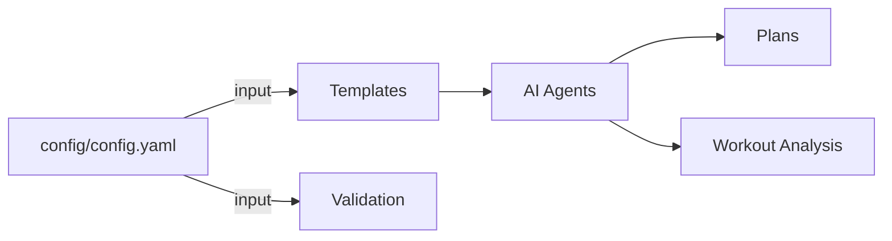
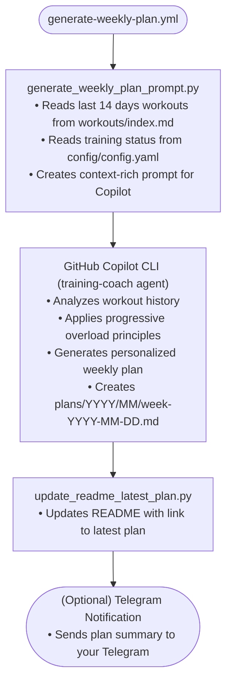
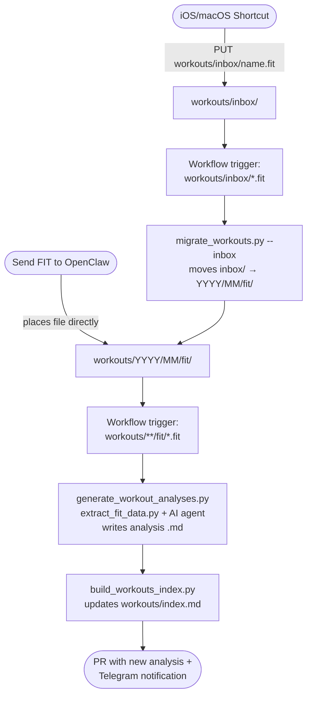
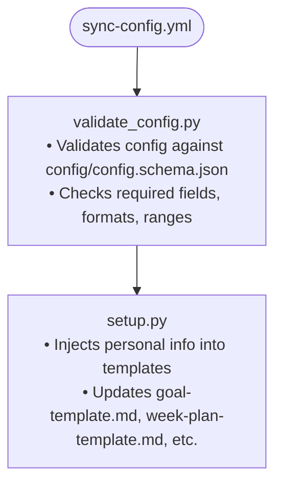

# 🏗️ Architecture

How running-trainer works under the hood.

---

## 🔍 Overview

This repository uses GitHub Actions and GitHub Copilot to automate training plan generation and workout analysis. No external APIs or services required beyond your GitHub Copilot subscription.



---

## ⚡ Automation Flows

### 📅 Weekly Plan Generation

Runs every **Sunday at 4:00 PM CET** (or manually triggered).



### 🏃 Workout Processing

Triggered when `.fit` files are pushed to `workouts/inbox/` (via iOS Shortcut or OpenClaw) or directly to `workouts/**/fit/`.



#### Workout data layout

```
workouts/
├── inbox/                        ← landing zone for new FIT uploads
├── YYYY/
│   └── MM/
│       ├── fit/
│       │   └── YYYY-MM-DD-HHMMSS-Type-Device.fit
│       └── analysis/
│           └── YYYY-MM-DD-HHMMSS-Type-Device.md
└── index.md                      ← auto-generated summary table
```

### 🔄 Config Sync

Triggered when `config/config.yaml` changes.



---

## 📂 Repository Structure

```
running-trainer/
├── config/                  # All configuration files
│   ├── config.yaml          # Central configuration (personal info, preferences)
│   ├── config.schema.json   # JSON Schema for config validation
│   ├── goals/               # Long-term training goals
│   │   └── 2026-11-half-marathon-sub2h.md
│   └── data/                # Runtime data files
│       └── penalties.yaml   # Run-or-pay penalty tracking
│
├── workouts/                # All workout data
│   ├── inbox/               # Landing zone for new FIT uploads
│   ├── YYYY/
│   │   └── MM/
│   │       ├── fit/         # Raw Apple Watch exports (.fit)
│   │       └── analysis/    # AI-generated workout analyses (.md)
│   └── index.md             # Auto-generated workout history table
│
├── health/                  # Health metrics from Health Auto Export
│   ├── daily/
│   │   └── YYYY/
│   │       └── MM/
│   │           └── YYYY-MM-DD.json   # raw HealthAutoExport data
│   ├── charts/              # trend charts (HRV, RHR, sleep, heatmap)
│   ├── yearly/
│   │   ├── YYYY.md          # yearly report
│   │   └── charts/YYYY/     # yearly charts
│   ├── index.md             # auto-generated health summary table
│   └── METRICS.md           # health metrics reference guide
│
├── plans/                   # Training plans by date
│   └── YYYY/MM/
│       └── week-YYYY-MM-DD.md
│
├── templates/               # Reusable templates for AI agents
│   ├── goal-template.md
│   ├── week-plan-template.md
│   └── workout-analysis-template.md
│
├── scripts/                 # Automation scripts
│   ├── build_workouts_index.py
│   ├── extract_fit_data.py
│   ├── generate_weekly_plan_prompt.py
│   ├── generate_workout_analyses.py
│   ├── setup.py
│   ├── update_readme_latest_plan.py
│   └── validate_config.py
│
├── tests/                   # Test suite
│   ├── test_extract_fit_data.py
│   ├── test_generate_workout_analyses.py
│   ├── test_generate_weekly_plan_prompt.py
│   ├── test_setup.py
│   └── test_validate_config.py
│
├── docs/                    # Documentation
│   ├── SETUP.md
│   ├── USAGE.md
│   └── ARCHITECTURE.md
│
└── .github/
    ├── agents/              # Custom Copilot agents
    │   ├── training-coach.agent.md
    │   └── workout-analyst.agent.md
    │
    ├── skills/              # Copilot skills (domain expertise)
    │   ├── fit-file-parsing/SKILL.md
    │   ├── heart-rate-zones/SKILL.md
    │   ├── pace-analysis/SKILL.md
    │   ├── periodization/SKILL.md
    │   ├── progressive-overload/SKILL.md
    │   ├── training-load/SKILL.md
    │   └── workout-prescriptions/SKILL.md
    │
    └── workflows/           # GitHub Actions
        ├── generate-analyses-from-fit.yml
        ├── generate-weekly-plan.yml
        ├── sync-config.yml
        └── tests.yml
```

---

## 📜 Scripts Reference

| Script | Purpose | Triggered By |
|--------|---------|--------------|
| `extract_fit_data.py` | Parse `.fit` files, extract metrics | `generate_workout_analyses.py` |
| `generate_workout_analyses.py` | Generate AI workout analyses | Push to `workouts/fit/` |
| `build_workouts_index.py` | Generate `workouts/index.md` | After analyses |
| `generate_weekly_plan_prompt.py` | Create prompt for weekly plan | Sunday 4 PM CET |
| `update_readme_latest_plan.py` | Update README with latest plan | After plan generation |
| `validate_config.py` | Validate `config/config.yaml` | Every push/PR |
| `setup.py` | Sync config to templates | Config changes |

---

## 🤖 AI Agents

### 🏋️ Training Coach

**File:** `.github/agents/training-coach.agent.md`

Generates weekly training plans based on:
- Recent workout performance
- Current goal and timeline
- Training status (sick, injured, etc.)
- Progressive overload principles

### 📊 Workout Analyst

**File:** `.github/agents/workout-analyst.agent.md`

Analyzes individual workouts:
- Heart rate zone distribution
- Pace analysis
- Effort assessment
- Recovery recommendations

---

## 🧠 Skills

Domain expertise files that enhance AI agent capabilities:

| Skill | Purpose |
|-------|---------|
| `fit-file-parsing` | Understanding FIT file data |
| `heart-rate-zones` | HR zone calculations and analysis |
| `pace-analysis` | Running pace interpretation |
| `periodization` | Training phase planning |
| `progressive-overload` | Safe volume/intensity increases |
| `training-load` | Fatigue and recovery tracking |
| `workout-prescriptions` | Workout type recommendations |

---

## 📋 Configuration Schema

`config/config.schema.json` validates `config/config.yaml` with:

- **Required sections:** `runner`, `preferences`, `current_goal`, `copilot`
- **Runner:** date_of_birth (YYYY-MM-DD), weight (30-200 kg), height (100-250 cm)
- **Preferences:** run_days (array), long_run_day, weekly_runs (1-7)
- **Training status:** active, sick, injury, holidays, returning
- **Goal file:** Must be in `config/goals/` directory

---

## 🔒 Security

- PAT token stored as encrypted GitHub secret
- Token only accessible to repository workflows
- Copilot API calls authenticated with your token
- No data leaves GitHub ecosystem
- Rotate tokens periodically (every 3-6 months)

---

## 📖 Next Steps

- **[Setup Guide](SETUP.md)** - Initial configuration
- **[Usage Guide](USAGE.md)** - Day-to-day usage
