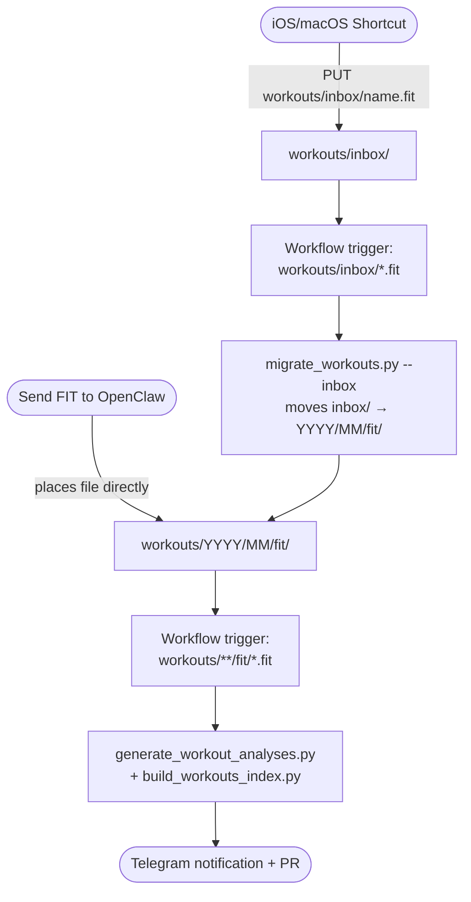

# 📘 Usage Guide

Day-to-day usage of your running-trainer repository.

---

## 🏃 Adding Workouts

### iOS Shortcut (Recommended)

Upload workouts directly from your iPhone/Apple Watch using an iOS Shortcut.



#### Prerequisites

**Create a GitHub Personal Access Token (PAT)**
1. Go to [GitHub Settings > Fine-grained tokens](https://github.com/settings/tokens?type=beta)
2. Click "Generate new token"
3. Name: `Workout Upload`
4. Repository access: Select your `running-trainer` repo only
5. Permissions: Set **Contents** to "Read and write"
6. Copy the token immediately

#### Create the Shortcut

Open the **Shortcuts** app on your iPhone and tap **+** to create a new shortcut. Add these 6 actions in order:

---

**Step 1: Receive input from Share Sheet**

Search for "Receive" and add the **Receive input from Share Sheet** action.

- Tap "Images and 18 more" and change it to **Files**
- This allows the shortcut to appear when you share a `.fit` file from any app

*What it does:* When you tap Share on a `.fit` file and select this shortcut, the file becomes the input for the next steps.

---

**Step 2: Get Details of Files**

Search for "Get Details" and add the **Get Details of Files** action.

- It will automatically connect to "Shortcut Input" from Step 1
- Tap "File Size" and change it to **Name**

*What it does:* Extracts the filename (e.g., `2026-01-18 Morning Run.fit`) so we can use it in the upload URL.

---

**Step 3: Replace Text**

Search for "Replace" and add the **Replace Text** action.

- In the "Find" field, type a single space: ` `
- In the "Replace with" field, type a hyphen: `-`
- It will automatically use "Name" from Step 2 as input

*What it does:* Converts spaces to hyphens (e.g., `2026-01-18-Morning-Run.fit`) because URLs cannot contain spaces.

> **Tip:** Apple Watch filenames often contain invisible "non-breaking spaces" that look like regular spaces but aren't. If uploads fail, duplicate this action and use Option+Space in the Find field.

---

**Step 4: Base64 Encode**

Search for "Base64" and add the **Base64 Encode** action.

- **Important:** The input will default to "Updated Text" from Step 3 - this is wrong!
- Tap the input field, tap **Clear Variables**, then tap **Select Variable**
- Scroll up and select **Shortcut Input** (the original file from Step 1)
- Make sure "Encode" is selected (not "Decode")

*What it does:* Converts the binary `.fit` file into text that can be sent via the GitHub API. Base64 is a standard encoding that represents binary data as ASCII characters.

> **Common mistake:** If you encode "Updated Text" instead of "Shortcut Input", you'll upload the filename as text instead of the actual file contents. The file will appear empty or contain just the filename.

---

**Step 5: Get Contents of URL**

Search for "URL" and add the **Get Contents of URL** action. This is the main upload step.

**URL:**
```
https://api.github.com/repos/YOUR_USERNAME/running-trainer/contents/workouts/inbox/[Updated Text]
```
- Replace `YOUR_USERNAME` with your GitHub username
- Tap at the end after `/inbox/` and select **Updated Text** from Step 3 (the sanitized filename)

**Method:**
- Tap "GET" and change to **PUT**

**Headers:**
- Tap "Headers" to expand
- Add header: `Authorization` with value `Bearer YOUR_PAT_TOKEN`
  - Replace `YOUR_PAT_TOKEN` with the token from Prerequisites
- Add header: `Accept` with value `application/vnd.github.v3+json`

**Request Body:**
- Tap "Request Body" and select **JSON**
- Add two fields:
  - Key: `message` → Value: `Add workout` (plain text)
  - Key: `content` → Value: Select **Base64 Encoded** from Step 4

*What it does:* Uploads the file to your GitHub repository using the GitHub Contents API. The API creates a new commit with your file in the `workouts/inbox/` directory (auto-migrated to `workouts/YYYY/MM/fit/` by workflow).

---

**Step 6: Show Notification**

Search for "notification" and add the **Show Notification** action.

- Title: `Workout Uploaded`
- Body: `Check Telegram for analysis link`

*What it does:* Confirms the upload succeeded. After this, GitHub Actions automatically generates an AI analysis and sends you a Telegram notification with a link to review it.

#### Usage

1. Export workout as `.fit` from **WorkOutDoors** or **Apple Fitness**
2. Tap **Share** → select your shortcut
3. Done! GitHub Actions will generate an analysis and notify you via Telegram

#### Troubleshooting

| Problem | Solution |
|---------|----------|
| Filename has weird characters | Apple Watch uses non-breaking spaces. Add a second "Replace Text" action: Option+Space → `-` |
| Workflow not triggering | Check file ends with `.fit` and is in `workouts/inbox/` or `workouts/YYYY/MM/fit/` |
| 422 error | File already exists with that name, or filename has invalid characters |

---

### Send FIT to OpenClaw (Alternative)

You can also send the `.fit` file directly to OpenClaw via Telegram.

1. Export `.fit` from WorkOutDoors or Apple Fitness
2. Send the file to OpenClaw on Telegram
3. OpenClaw places it directly in `workouts/YYYY/MM/fit/` based on the filename date
4. GitHub Actions generates the analysis automatically and notifies you via Telegram

This method skips the inbox — the file goes directly to its final location.

---

### Manual Upload (Alternative)

1. **Export `.fit` file** from Apple Watch
2. **Create a new branch** and add the file to `workouts/inbox/` or directly to `workouts/YYYY/MM/fit/`
3. **Push the branch** - a PR will be auto-created with the analysis

GitHub Actions automatically:
- Generates workout analysis into `workouts/YYYY/MM/analysis/`
- Updates `workouts/index.md`
- Commits changes back to the PR branch

4. **Review the analysis** in the auto-created PR
5. **Merge to main** when satisfied

> **Note:** You can also push directly to `main` if you prefer - the workflow runs on any branch.

### Manual (Optional)

If you prefer to run scripts locally:

```bash
# Generate missing analyses (requires Copilot CLI)
python3 scripts/generate_workout_analyses.py \
  --fits-dir workouts \
  --analysis-dir workouts \
  --template templates/workout-analysis-template.md \
  --agent workout-analyst \
  --model gpt-5.2

# Rebuild workout index
python3 scripts/build_workouts_index.py

# Commit and push
git add . && git commit -m "Add workout" && git push
```

---

## 📊 Adding Health Data

Health data comes from the **Health Auto Export** iOS app.

### Send JSON to OpenClaw

1. Export from Health Auto Export (single day or multi-day JSON)
2. Send the JSON file to OpenClaw via Telegram
3. OpenClaw runs `scripts/split_health_export.py` to split into daily files in `health/daily/YYYY/MM/`
4. GitHub Actions regenerates `health/index.md` and trend charts automatically

### health/inbox/ (future)

A `health/inbox/` landing zone (similar to `workouts/inbox/`) is planned for direct PUT uploads from the Health Auto Export app.

---

## 📅 Weekly Training Plans

### Automatic Generation

Every **Sunday at 4:00 PM CET**, a new training plan is automatically generated based on:
- Your last 14 days of workouts
- Your current goal
- Progressive training principles
- Your training status (sick, injured, etc.)

Plans are saved to `plans/YYYY/MM/week-YYYY-MM-DD.md`.

### Manual Generation

Trigger plan generation anytime:
1. Go to **Actions** tab
2. Select **"Generate Weekly Training Plan"**
3. Click **"Run workflow"**

---

## ⚙️ Updating Your Configuration

### ⚖️ Update Weight

1. Edit `config/config.yaml`:
   ```yaml
   runner:
     weight: 92.5  # Your new weight
   ```

2. Commit and push to `main`

3. The `sync-config.yml` workflow automatically:
   - Validates your config
   - Updates all templates
   - Commits changes

### 🏥 Update Training Status

Track when you're sick, injured, on holidays, or returning from a break:

| Status | When to Use | AI Behavior |
|--------|-------------|-------------|
| `active` | Normal training (default) | Regular progressive training |
| `sick` | Currently ill | Skip workouts, prioritize rest |
| `injury` | Currently injured | Avoid aggravating exercises |
| `holidays` | On vacation | Lighter, flexible workouts |
| `returning` | Coming back from break | Gradual ramp-up protocol |

**How to update:**

1. Edit `config/config.yaml`:
   ```yaml
   training_status:
     status: sick
     note: 'Cold since Monday, hoping to recover by weekend'
   ```

2. Commit and push - the next weekly plan will account for your status

**Examples:**

```yaml
# Going on holidays
training_status:
  status: holidays
  note: 'Beach vacation, limited running options'

# Recovering from illness
training_status:
  status: returning
  note: 'Back after 5 days with flu, taking it easy'

# Back to normal
training_status:
  status: active
  note: ''
```

### 🤖 Change AI Model

Edit `config/config.yaml`:

```yaml
copilot:
  plan_model: claude-sonnet-4.6    # Model for weekly training plan generation
  analysis_model: claude-haiku-4.5 # Model for per-workout analysis (cheaper)
  # model: claude-sonnet-4.6      # Optional fallback if specific models are not set
```

**Available models (GitHub Copilot):**
- `claude-sonnet-4.6` - Recommended for plan generation (reasoning, context-heavy tasks)
- `claude-haiku-4.5` - Recommended for analysis (~3x cheaper, structured tasks)
- `gpt-5-mini` - Lightweight, very cheap
- `gemini-2.5-pro` - Google's capable model

> Model availability depends on your GitHub Copilot subscription tier.

**Fallback behavior:** if `plan_model` or `analysis_model` are not set, workflows fall back to `model`.

### ⏰ Change Schedule Time

Edit `.github/workflows/generate-weekly-plan.yml`:

```yaml
schedule:
  - cron: '0 15 * * 0'  # Sunday at 4:00 PM CET (15:00 UTC)
```

**Cron format:** `minute hour day-of-month month day-of-week`

**Timezone:** GitHub Actions uses UTC. Adjust accordingly:
- CET (UTC+1): Subtract 1 hour
- EST (UTC-5): Add 5 hours
- PST (UTC-8): Add 8 hours

---

## 💸 Run or Pay (Optional)

A motivation feature that tracks monetary penalties for missed workouts. Disabled by default.

### How It Works

1. Each week, the system counts your completed running workouts
2. If you miss any planned runs, a penalty is added to your yearly total
3. The penalty is shown in your weekly training plan
4. Total resets automatically at the start of each year

### Configuration

Enable in `config/config.yaml`:

```yaml
run_or_pay:
  enabled: true
  penalty_per_week: 10  # Amount per week with missed runs
  currency: EUR         # Display currency (EUR, USD, GBP, etc.)
```

### When Penalties Apply

| Status | Penalty applies? |
|--------|------------------|
| `active` | Yes |
| `returning` | Yes |
| `sick` | No |
| `injury` | No |
| `holidays` | No |

Penalties only apply when you're actively training (`active` or `returning` status). If you're sick, injured, or on holidays, missed workouts won't count against you.

### Weekly Plan Output

When enabled, your weekly plan includes a penalty summary:

```markdown
## 💸 Run or Pay

**Year 2026 Total Penalty:** 30 EUR
**Weeks tracked:** 5 (3 with penalties)

🔥 **3 consecutive weeks with missed runs!** Time to get back on track.

⚠️ Last week: 2/3 runs completed → +10 EUR penalty
```

### Data Storage

Penalties are tracked in `config/data/penalties.yaml`:

```yaml
year: 2026
total_penalty: 30
currency: EUR
history:
  - week: "2026-01-06"
    planned_runs: 3
    completed_runs: 3
    penalty_applied: 0
  - week: "2026-01-13"
    planned_runs: 3
    completed_runs: 2
    penalty_applied: 10
```

### Yearly Reset

The total penalty and history automatically reset on January 1st (or when the first weekly plan of the new year is generated).

---

## 📆 Weekly Workflow

### Recommended Routine

1. **Sunday:** Review auto-generated weekly plan
2. **Training days:** Complete workouts, export `.fit` files
3. **After each run:** Push `.fit` file to `workouts/inbox/` (Shortcut) or send to OpenClaw
4. **End of week:** Check `workouts/index.md` for summary

### File Naming Conventions

**Workouts:**
- Preferred: `YYYY-MM-DD-HHMMSS-Description.fit`
- Minimum: Start with `YYYY-MM-DD` for sorting

**Weekly plans:**
- Format: `week-YYYY-MM-DD.md` (Monday of that week)
- Location: `plans/YYYY/MM/`

---

## ✅ Validation

Config is validated on every push. To validate locally:

```bash
python3 scripts/validate_config.py
```

This catches:
- Missing required fields
- Invalid date formats
- Invalid status values
- Values out of range

---

## 🧪 Running Tests

```bash
# Install dependencies
python3 -m pip install -r requirements.txt

# Run all tests
python3 -m pytest tests/ -v

# Run with coverage
python3 -m pytest tests/ -v --cov=scripts --cov-report=term-missing
```

---

## 🔧 Troubleshooting

### Workflow Not Running?

1. Check **Actions** tab for errors
2. Verify `.fit` files are in `workouts/inbox/` or `workouts/YYYY/MM/fit/`
3. Check `COPILOT_TOKEN` secret is set

### Plan Not Generated?

1. Verify `COPILOT_TOKEN` has correct permissions
2. Check Actions > "Generate Weekly Training Plan" logs
3. Ensure at least one workout exists

### Scripts Not Working?

```bash
python3 -m pip install -r requirements.txt --upgrade
```

---

## 📖 Next Steps

- **[Setup Guide](SETUP.md)** - Initial configuration
- **[Architecture](ARCHITECTURE.md)** - How it works
